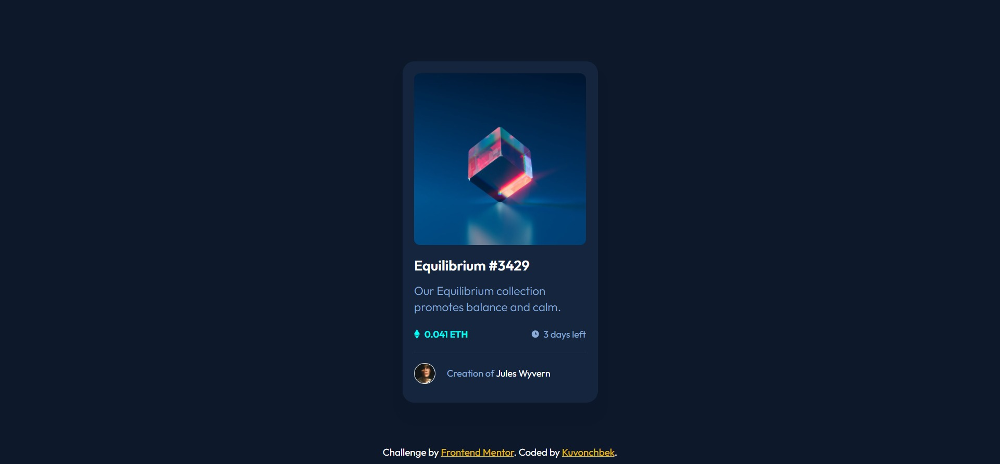

# Frontend Mentor - NFT preview card component solution

This is my solution to the [NFT preview card component challenge on Frontend Mentor](https://www.frontendmentor.io/challenges/nft-preview-card-component-SbdUL_w0U). Frontend Mentor challenges help you improve your coding skills by building realistic projects.

### Screenshot

### Link

https://nft-preview-card-component-by-kuvonchbek.netlify.app/

### Built with

- Semantic HTML5 markup
- CSS
- Flexbox

## Author

- Github - [Kuvonchbek](https://github.com/kukhalilov)
- Frontend Mentor - [@kukhalilov](https://www.frontendmentor.io/profile/kukhalilov)
