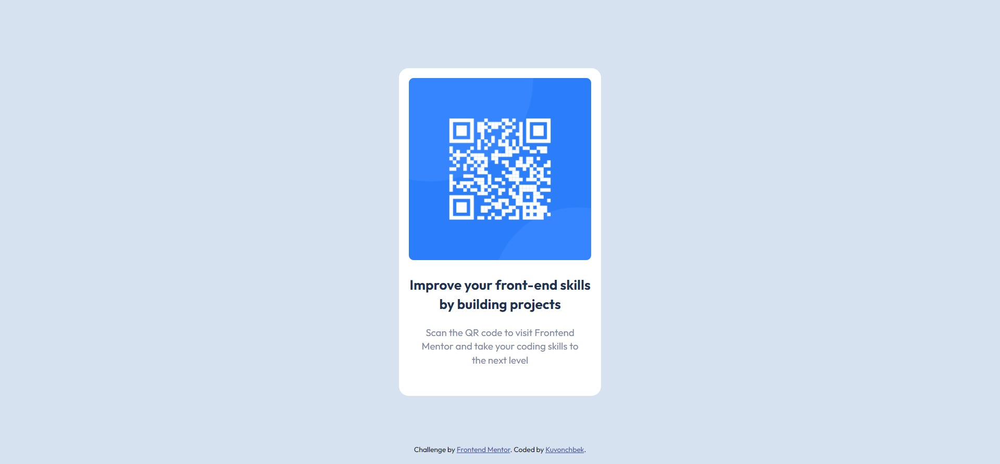

# Frontend Mentor - QR code component solution

This is my solution to the [QR code component challenge on Frontend Mentor](https://www.frontendmentor.io/challenges/qr-code-component-iux_sIO_H). Frontend Mentor challenges help you improve your coding skills by building realistic projects. 

### Screenshot

### Built with

- Semantic HTML5 markup
- CSS
- Flexbox

## Author

- Github - [Kuvonchbek](https://github.com/kukhalilov)
- Frontend Mentor - [@kukhalilov](https://www.frontendmentor.io/profile/kukhalilov)

